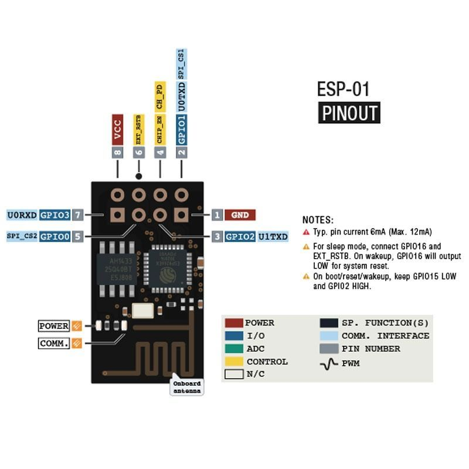
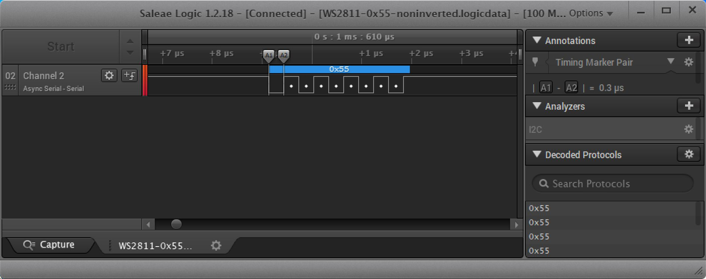
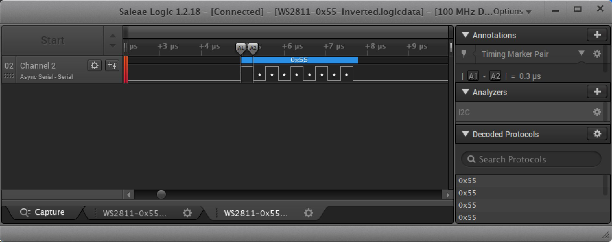

# The WS2811 LED String

I bought a string of 50 individually addressable LED lights, and each one has a WS2811 chip. There's one data line going to the
whole string, and although I've found more than one spec for the WS2811 chip, the one that seems to agree with my string of LEDs says
that the timing looks like this:

    _______
    |     |__________|       Logic 0: Time On: 220-380ns, Time Off: 580-1000ns
    
    ____________
    |          |__________|  Logic 1: Time On: 580-1000ns, Time Off: 580-1000ns

# The Microcontroller: An ESP-01 ESP8266 Module

 I'm going to use an ESP-01 module to control this, which is just about the smallest ESP8266 module you can find. It doesn't have
 a lot of available GPIOs to play with, but it does have GPIO2, which conveniently doubles as the TX line for UART1. 
 

I would like to see if I can use UART1 for some hardware assistance rather than bit-banging the GPIO line.
It looks like we can use four UART bits at 300ns each to send both 0 and 1 WS2811 bits like this:

    UART bits:     | Bit 0 | Bit 1 | Bit 2 | Bit 3 |
                   _________
    WS2811 0 bit:  |       |_______________________|
    
                   | 300ns |        900ns          |

                   _________________
    WS2811 1 bit:  |               |_______________|
    
                   |     600ns     |     600ns     |

# The Baud Rate: It's High

For a bit time of 300ns, the baud rate is 1/300ns = 3,333,333. That's a pretty high baud rate, so let's verify that we can get it
to run that fast. Using a small Arduino sketch that initializes UART1 at 3,333,333 baud and repeated writes 0x55, I captured this trace:

    // the setup function runs once when you press reset or power the board
    void setup() {
      Serial.begin(115200);
      Serial1.begin(3333333);
    }

    // the loop function runs over and over again forever
    void loop() {
      Serial1.write(0x55);
      delay(1);
    }

The time between the two markers is 0.3us, which is exactly the 300ns that we were hoping to see.

# Inverting The Output

There's another problem. The WS2811 signal idles low, but the UART idles high, so we'll need to invert it.
Other solutions online suggested adding a transistor or something to invert the output, but I want to do it in software.
Many UARTS can be configured to invert their signals, and thankfully, the ESP8266 is no exception.
Inverting the UART1 TX output can be done by setting the uart_txd_inv bit in the ESP8266 UART1 CONF0 register. It took me a
bit of Googling to find the address of this register, but I found it eventually.

    // the setup function runs once when you press reset or power the board
    void setup() {
      uint32_t *UART1_CONF0 = (uint32_t *)(0x60000F00 + 0x20);
  
      Serial.begin(115200);
      Serial1.begin(3333333);
  
      // Set the uart_txd_inv bit in the UART_CONF0 register for UART1 to invert the TX output.
      *UART1_CONF0 |= (1 << 22);
    }

    // the loop function runs over and over again forever
    void loop() {
      Serial1.write(0x55);
      delay(1);
    }

We've successfully inverted the output so now the UART's logic levels match the WS2811's.

# The Bitstream

Even though each WS2811 bit occupies four UART bits, we can't just write the usual eight-bit bytes to the UART, because we have
to take the start and stop bits into consideration. So we need to configure the UART to work with six-bit data and one stop bit.
We will send two WS2811 bits with one six-bit write to the UART like this (keep in mind the UART signal is inverted):

    WS2811 signal:  |            0 bit          |            1 bit           |
                    ________                    _______________
                    |      |____________________|             |_______________
    
    UART signal:    | Strt |  D0  |  D1  |  D2  |  D3  |  D4  |   D5  | Stop |

So, the start and stop bits take care of themselves. D1, D2, and D5 will always be low. And D3 will always be high. So, the only
two bits we need to think about will be D0 and D4, which will each be low if we're sending a 0 bit, or high if we're sending a 1 bit.

The WS2811 protocol is like this:

- 24 bits of data sent per LED: one byte for red, one byte for green, one byte for blue (in that order)
- High bit of each byte sent first
- One three-byte sequence needed for each LED: first sequence goes to first LED, second sequence goes to second LED, etc
- Need at least a 280us delay after the last LED before starting over again with the first LED

# Wiring It Up

As for wiring the LED string to the ESP-01, it's pretty easy because there are only three wires:

- Blue wire goes to GND
- Red wire goes to +5V
- White wire goes to GPIO2 on the ESP-01 module

There are many ways to program the ESP-01, but the easiest way I've found is to program it with a NodeMCU board. The interesting thing
is that the processor on the NodeMCU isn't even involved. We just use the progamming circuitry on the board and wire the signals to
the ESP-01. I won't get into the details here, you can just Google it to see how it's done.

